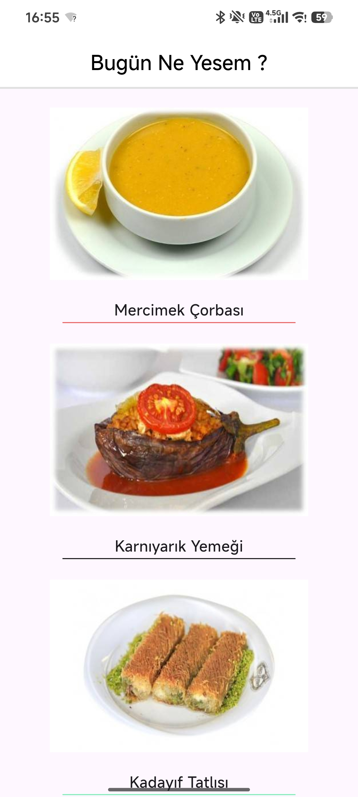
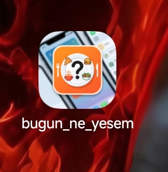
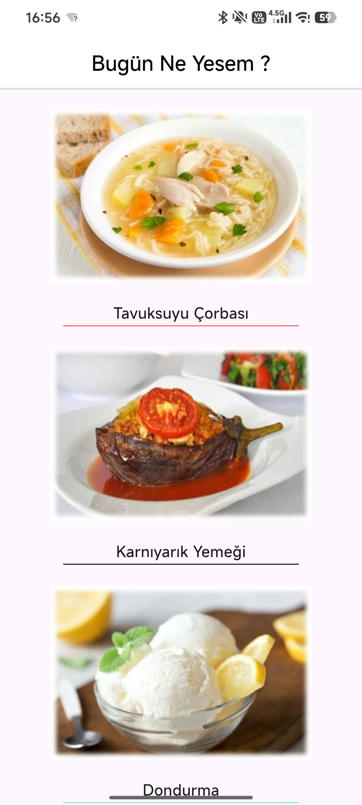

# 🍽️ What to Eat Today

A Flutter application that randomly suggests meals for users.

## 📱 Preview



## 🎥 Demo

A short demonstration of the application in use.

[▶️ Watch the demo video](assets/demorecordings/screenrecorder/screenrecorder_1.mp4)

## ✨ Features

* 🎲 Randomly suggests meals
* 🍽️ Displays meal suggestions with images
* 🖼️ Visual meal presentation
* 📱 Mobile-focused user interface
* 🎨 Clean and simple Flutter UI
* ⚡ Lightweight application experience

## 📸 Screenshots

### Home Screen



### Meal Suggestion


### Another Meal Suggestion




## 🛠️ Tech Stack

* **Flutter**
* **Dart**
* **Android Studio**

## 📂 Project Structure

```text
what-to-eat-today/
├── android/
├── assets/
│   ├── demorecordings
│   └── images
├── ios/
├── lib/
├── .gitignore
├── analysis_options.yaml
├── pubspec.lock
├── pubspec.yaml
└── README.md
```

The main application code is located in the `lib/` directory, while application media and visual assets are stored in `assets/`.

## 🚀 Getting Started

### Requirements

To run this project, you will need:

* Flutter SDK
* Dart SDK
* Android Studio
* An Android device or emulator

### Installation

Clone the repository:

```bash
git clone https://github.com/efehanmert/what-to-eat-today.git
```

Navigate to the project directory:

```bash
cd what-to-eat-today
```

Install the project dependencies:

```bash
flutter pub get
```

Run the application:

```bash
flutter run
```

## 🎯 Project Purpose

This project was created as a Flutter learning project to practice building a complete mobile application from development to a finished, presentable product.

The project focuses on Flutter fundamentals, user interface development, stateful application behavior, asset management, and the use of Git and GitHub throughout the development process.

## 🗺️ Project Status

**Completed**

The first complete version of the application has been finished, including the user interface, application functionality, visual assets, and application icon.

## 👨‍💻 Author

**Efehan Mert**

📧 [business.efehan@gmail.com](mailto:business.efehan@gmail.com)

GitHub: [@efehanmert](https://github.com/efehanmert)
